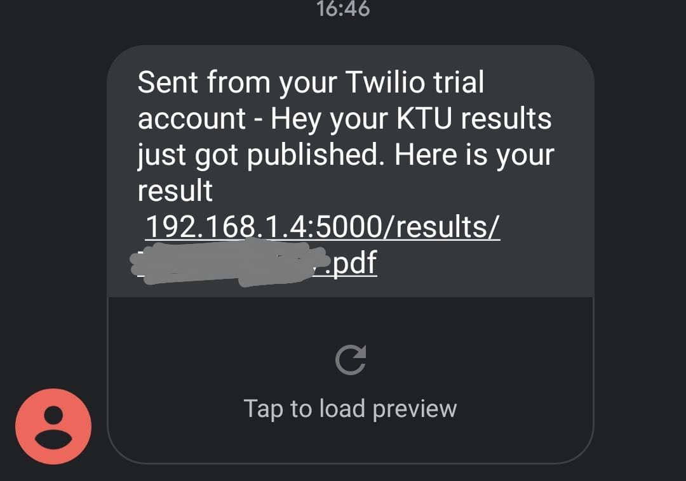

A simple flask server that constantly checks the KTU website for notifications regarding result publishing and auto logins into your portal and downloads your grade card and notifies via SMS.The result portal normally breaks after results are published due to high traffic.So this scripts constantly pings the portal and tries to download your result for you.

### Setup

``` 
git clone https://github.com/mdb571/ktu-result-notify.git
cd ktu-result-notify
```
Create a virtual environment and install the dependencies
```
pip install -r requirements.txt
flask run
```
Create a `results` folder in the project directory

Create an account on [twilio](https://www.twilio.com/), buy a virtual number and copy your API Keys from the Developer Console

Set the following environment variables in your `.env` file

```
// TWILIO CONFIGURATION
ACCOUNT_SID=  
AUTH_TOKEN=
TWILIO_NO= # your twilio no
MY_NUM=  #the no to which sms is sent

// KTU INFO
KTU_ID=  
KTU_PASS= # login password
SEM= #semester (eg. S4/S5)
// 
DEPLOY_URL= #  server url
DOWNLOAD =  # path to your 'results' folder
```
### Deployment 
 I suggest running this script locally on your system since there're arent lot many options for you to deploy scripts that use selenium on the cloud. There are services like [heroku](https://heroku.com) and [replit](https://replit.com) which allows you to do so but at the cost of the server going into sleep.</br> 
 Note:
 - You can deploy on heroku with a clock process running a scheduler , but it'll exhaust your monthly free dyno hours in no time :/ 
 - Similary the replit hacker plan that comes along with the github student pack guarantees 100% uptime  but there are isssues with deploying flask and selenium together which I wasn't able to figure out

##### Linux / RPi
Run the server and and setup a cron job that constantly pings the `/check` endpoint of the server using [ping.sh](https://github.com/mdb571/ktu-result-notify/blob/main/ping.sh)
##### Windows
Run the server and use [Windows Task Scheduler](https://www.windowscentral.com/how-create-and-run-batch-file-windows-10) to run the [ping.bat](https://github.com/mdb571/ktu-result-notify/blob/main/ping.bat) at regular intervals

### Screenshot


### Contribution
Feel free to open a PR if you can improve this project. :)

